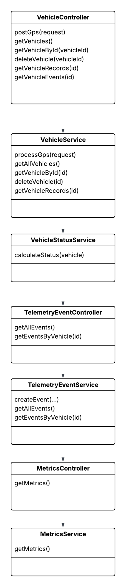
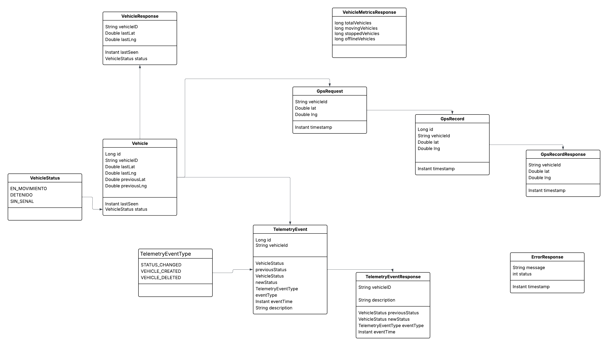
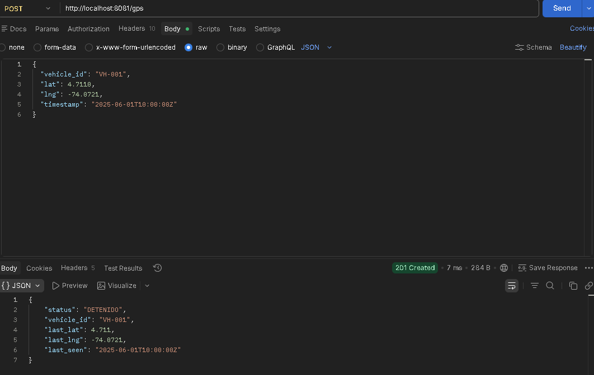
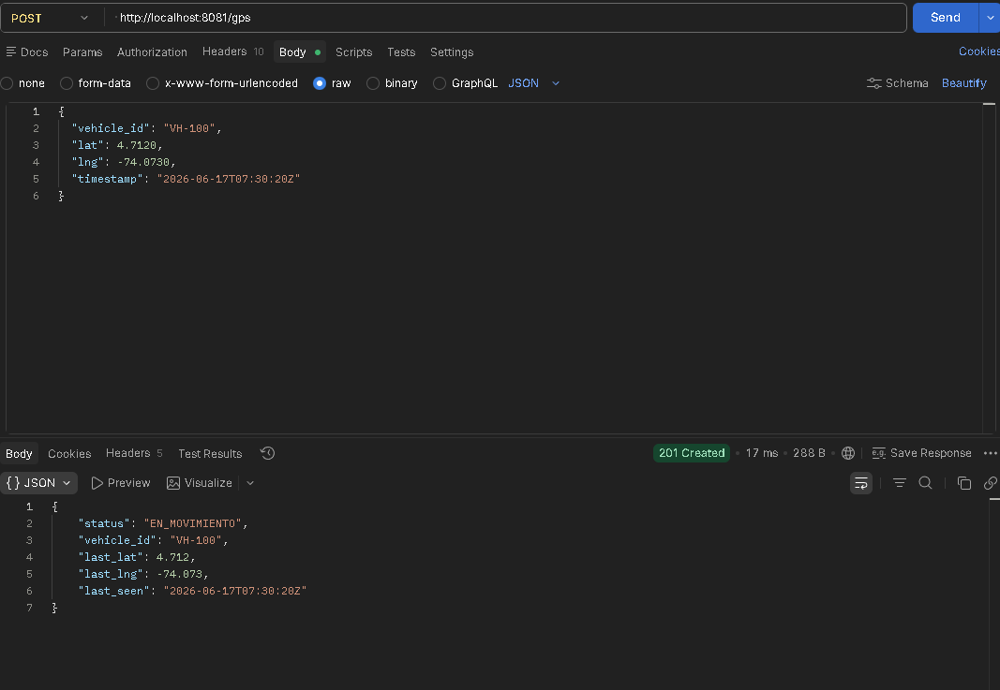
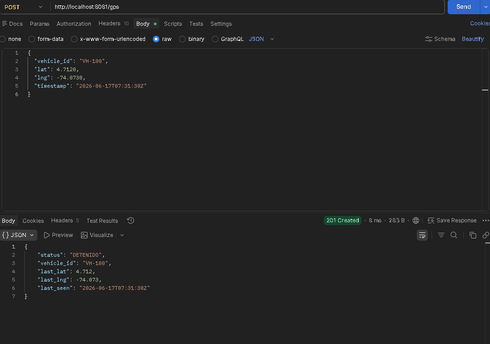
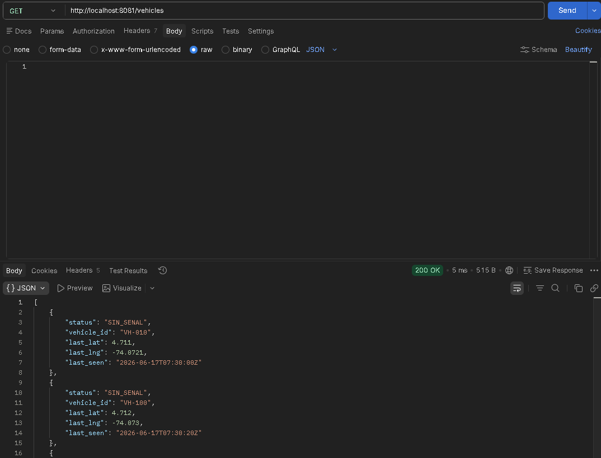
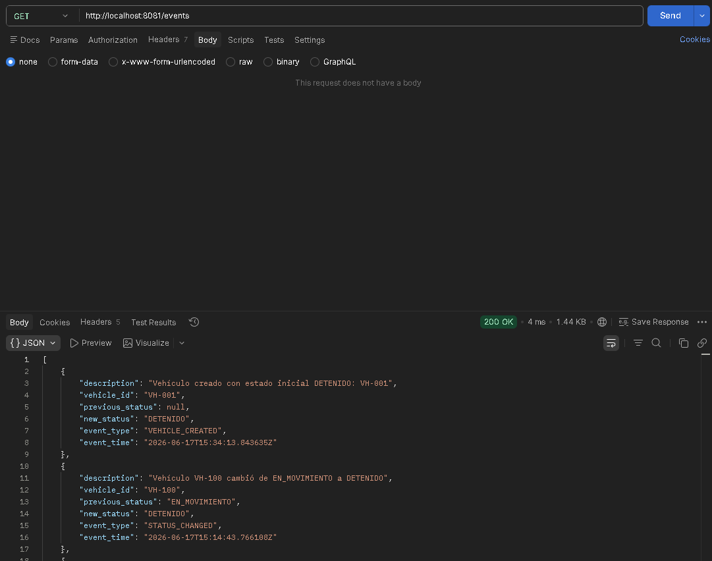
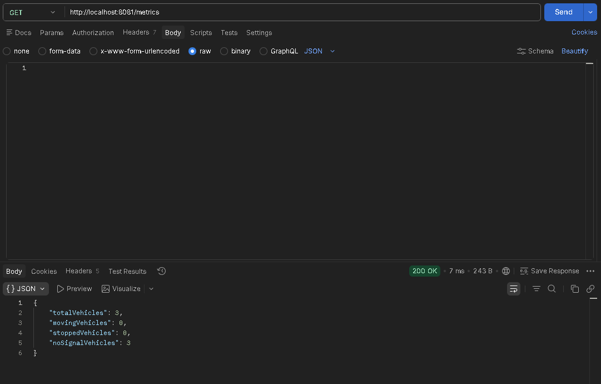
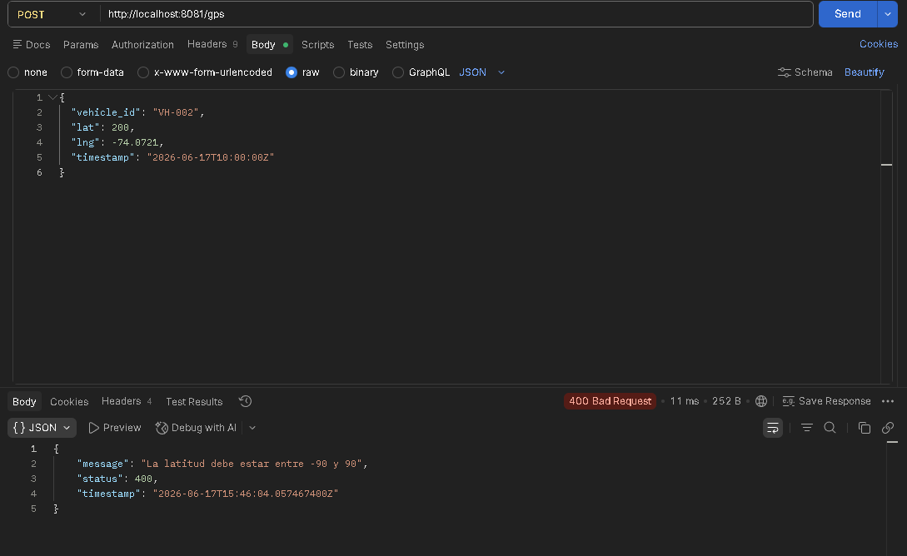
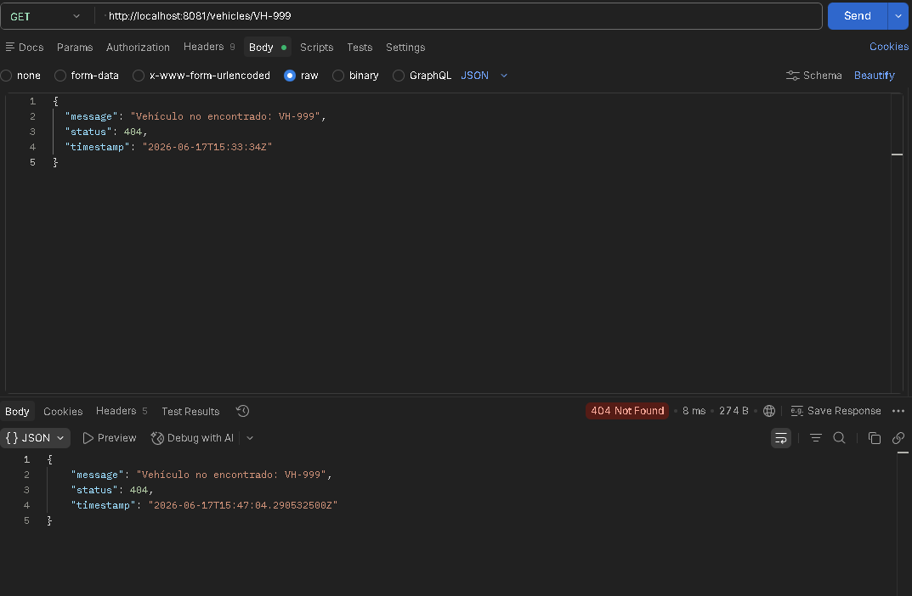

# Fleet Telemetry System 

Sistema de telemetría vehicular desarrollado con Spring Boot para el procesamiento de posiciones GPS, monitoreo de estados de vehículos, generación de eventos de auditoría y consulta de métricas operativas.

---

##  Descripción

Fleet Telemetry System permite recibir información GPS de vehículos, calcular automáticamente su estado operativo y almacenar un historial de posiciones.

El sistema identifica tres estados principales:

* **EN_MOVIMIENTO**: el vehículo cambia su posición.
* **DETENIDO**: el vehículo permanece sin cambios de posición durante más de 60 segundos.
* **SIN_SENAL**: el vehículo no reporta información durante más de 120 segundos.

Además, registra eventos de auditoría para cada cambio importante y expone métricas globales del sistema.

---

##  Tecnologías Utilizadas

* Java 17
* Spring Boot 3
* Spring Web
* Spring Data JPA
* H2 Database
* Lombok
* Maven
* Postman
* UML

---

##  Arquitectura

La aplicación sigue una arquitectura en capas:

```text
Controller
    ↓
Service
    ↓
Repository
    ↓
Database
```

### Componentes principales

* VehicleController
* VehicleService
* VehicleStatusService
* TelemetryEventController
* TelemetryEventService
* MetricsController
* MetricsService

---

##  Modelo de Dominio



---

##  Diagrama de Componentes



---

##  Modelo de Datos

### Vehicle

Representa el estado actual de un vehículo.

Campos principales:

* vehicleId
* lastLat
* lastLng
* previousLat
* previousLng
* lastSeen
* status

---

### GpsRecord

Almacena el historial de posiciones GPS recibidas.

Campos principales:

* vehicleId
* lat
* lng
* timestamp

---

### TelemetryEvent

Registra eventos relevantes del sistema.

Tipos de evento:

* VEHICLE_CREATED
* STATUS_CHANGED
* VEHICLE_DELETED

---

##  Estados del Vehículo

| Estado        | Descripción                                  |
| ------------- | -------------------------------------------- |
| EN_MOVIMIENTO | El vehículo cambió de posición               |
| DETENIDO      | Sin movimiento durante más de 60 segundos    |
| SIN_SENAL     | Sin comunicación durante más de 120 segundos |

---

##  API REST

### Registrar posición GPS

```http
POST /gps
```

Ejemplo:

```json
{
  "vehicle_id": "VH-100",
  "lat": 4.7110,
  "lng": -74.0721,
  "timestamp": "2026-06-17T07:30:00Z"
}
```

---

### Obtener todos los vehículos

```http
GET /vehicles
```

---

### Obtener vehículo por ID

```http
GET /vehicles/{vehicleId}
```

Ejemplo:

```http
GET /vehicles/VH-100
```

---

### Eliminar vehículo

```http
DELETE /vehicles/{vehicleId}
```

---

### Obtener historial GPS

```http
GET /vehicles/{vehicleId}/records
```

---

### Obtener eventos

```http
GET /events
```

---

### Obtener eventos por vehículo

```http
GET /vehicles/{vehicleId}/events
```

---

### Obtener métricas

```http
GET /metrics
```

Respuesta:

```json
{
  "totalVehicles": 2,
  "movingVehicles": 0,
  "stoppedVehicles": 0,
  "noSignalVehicles": 2
}
```

---

##  Manejo de Errores

### Vehículo inexistente

```http
GET /vehicles/VH-999
```

Respuesta:

```json
{
  "message": "Vehículo no encontrado: VH-999",
  "status": 404
}
```

---

### Coordenadas inválidas

```json
{
  "vehicle_id": "VH-002",
  "lat": 200,
  "lng": -74.0721
}
```

Respuesta:

```json
{
  "message": "La latitud debe estar entre -90 y 90",
  "status": 400
}
```

---

##  Evidencias de Pruebas

### Crear vehículo



### Cambio a estado EN_MOVIMIENTO



### Cambio a estado DETENIDO



### Obtener vehículos



### Eventos de telemetría



### Métricas



### Error de validación



### Vehículo inexistente



---

##  Ejecución Local

Clonar repositorio:

```bash
git clone <repository-url>
```

Entrar al proyecto:

```bash
cd fleet-telemetry-system
```

Compilar:

```bash
./mvnw clean install
```

Ejecutar:

```bash
./mvnw spring-boot:run
```

La aplicación estará disponible en:

```text
http://localhost:8081
```

---

##  Autor

David Carrasco

Ingenieron en Sistemas | Desarrollador Full Stack

GitHub:
https://github.com/dabbi20

